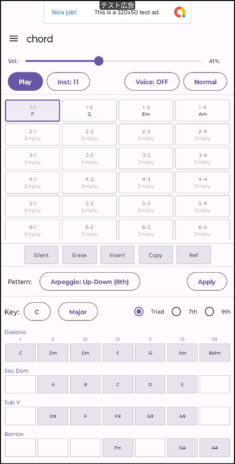
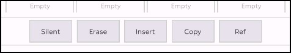
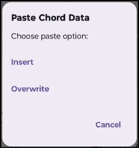
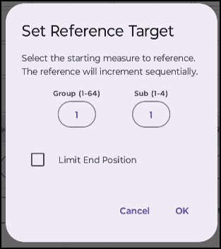
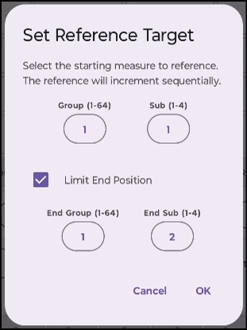

# 概要

InstaPlayComposeの Chord画面 では、コード進行を編集でき伴奏として使用することができます。

画面下に、キーに対応するダイアトニックコードが表示されます。
トライアド(3和音)、セブンス(4和音)、ナインス(5和音)も指定できます。
演奏パターンも、いくつかのアルペジオ奏法も選択可能です。
選択したコードの演奏パターンも含めて小節に設定できます。

Chord画面で小節をクリップボードにコピーしたデータは、Track画面に貼り付けることが可能です。

また、Chord画面の演奏をTrack画面のピアノロール上に重ねて表示(Overlay)することができるので、
編集の際に簡単に参照する事が可能です。

ヴォイシングを有効にすると、前後のコードとの関係性を考慮し自然な音の響きが得られるように、
スムーズな声部導行・転回形の自動選択・音の濁り防止を行う音の構成になります。

ヴォイシングの詳細については、こちら[ヴォイシングについて](voicing)を参照ください。

# 使い方の基本

基本的な入力の流れを以下に示します。
1. 入力したいセル（小節マス）をタップして選択します
2. 画面下部のコードパレットから入力したいコードをタップ
3. セルにコードがセットされ、自動的に次のセルへ選択が移動します。

複数の小節が選択されている状態で、コードをタップすると、選択されている全ての小節にコードが設定されます。

その際、パターンで選択している演奏パターンが小節に適用されます。

「Apply」を押下することで、コードはそのままに、選択状態の小節に設定されている演奏パターンのみ変更する事が可能です。

<iframe width="250" height="444" src="https://www.youtube.com/embed/NppUaIvcEGU" frameborder="0" allowfullscreen></iframe>

# コードパレットについて

画面下部のコードパレットには、ダイアトニックコードなどの複数のコードが表示されています。

コードは、キーとTriad/7th/9thに従って表示されます。
- キー 
  - 曲の主音（C〜B）とメジャー/マイナーを切り替えます。
- コード種別
  - Triad: トライアード（3和音：C, Dm, Em...）
  - 7th: 7thコード（4和音：Cmaj7, Dm7, G7...）
  - 9th: テンションコード（5和音：Cmaj9, Dm9, G9...）

|名称|解説|
|---|---|
|Diatonic（ダイアトニック）| そのキーの基本となる7つのコード（Ⅰ〜Ⅶ）。これらを並べるだけで楽曲の骨組みが完成します。|
|Sec Dom（セカンダリードミナント）|一時的な店長や展開のフックを作る応用コード|
|Sub V（裏コード）|セカンダリードミナントの代わりに使える、ジャズやポップスで人気の転換コード|
|Borrow（借用コード）| 同主調（メジャーとマイナー）から借りてくるエモーショナルなコード|

# キーについて

Chord画面に遷移した時に、ハンバーガーメニューに設定されているのと同じキーが、
Chord画面のキーに設定されますが、変更する事が可能です。

望みのコードが無い場合にはChord画面のキーを変更してみてください。

Chord画面のキー設定は、他の画面からChord画面に切り替わったタイミングで、曲に設定しているキーに設定が変わります。

# 小節の選択

小節のマスをタップすると小節を選択状態にできます。
何度かタップをすると、選択状態の切り替えができます。

小節の前半・後半だけを選択することも可能です。
小節の左側・右側付近をタップすると半分のみ選択できそれぞれ別のコード・演奏パターンを設定できます。

<iframe width="250" height="444" src="https://www.youtube.com/embed/4ibO_k1YdmQ" frameborder="0" allowfullscreen></iframe>

# 編集機能

小節マスの下にある、機能ボタンの使い方について説明します

### Silent

選択している小節をSilent状態(無音状態)にします。

### Erase

選択している小節をEmpty状態にします。

長押しの場合には選択中の小節を削除し、後ろの小節を前に詰めます。

小節が未選択状態で長押しする事で、全小節をクリアできます。

### Insert

選択している小節の手前に、Empty状態の小節を挿入します。

### Copy

選択している小節の設定をクリップボードにコピーします。

小節を選択状態にしたあと、その小節を長押しすると、挿入か上書きの選択が表示されます。
挿入の場合には以降の小節を後ろにずらしてから、コピーされた内容が設定されます。
上書きの場合にはコピーされた内容をそのまま上書きします。

<iframe width="250" height="444" src="https://www.youtube.com/embed/3TfnGvo-_ZA" frameborder="0" allowfullscreen></iframe>

コピーしたデータはTrack画面のピアノロール上にも貼り付けることが可能です

<iframe width="250" height="444" src="https://www.youtube.com/embed/wqdJ8IkYFOo" frameborder="0" allowfullscreen></iframe>

### Ref

同じフレーズやサビのリズムを何回もコピー＆ペーストせずに、特定の小節を参照することができます。参照先のパターンを変更すると、参照元も自動的に変更されます。

参照は小節単位の動作となります。小節の半分単位での参照はできません。

1. 参照を設定したい小節を複数選択します
2. Refを押して、参照設定ダイアログを開きます
3. 参照先の小節を指定します
  - 
4. LimitEndPositionを有効にした場合には、参照する小節の範囲を指定します。
  - 

例えば、小節を4つ選択している状態で、参照先を1-1に指定しているとします。

LimitEndPositionが無効の場合、1-1, 1-2, 1-3, 1-4 が参照先として設定されます。

<iframe width="250" height="444" src="https://www.youtube.com/embed/nX6oB9yRdIo" frameborder="0" allowfullscreen></iframe>

LimitEndPositionを有効にし、LimitEndPositionに1-2を指定した場合、
1-1, 1-2, 1-1, 1-2 が参照先として設定されます。

<iframe width="250" height="444" src="https://www.youtube.com/embed/VTHSTHZTu-w" frameborder="0" allowfullscreen></iframe>

# 便利なテクニック・Q＆A

- Q. 複数小節を一度に選択するには？
  - 最初の小節をタップしたあと、範囲の終わりの小節を 長押し すると、その間にある小節を一括選択できます（一括コピーや一括消去に便利です）。

- Q. コードの音を確認するには？
  - 小節を無選択状態して、コードボタンを押し続けると、設定されている演奏パターンでコードの音を鳴らし続けることができます。