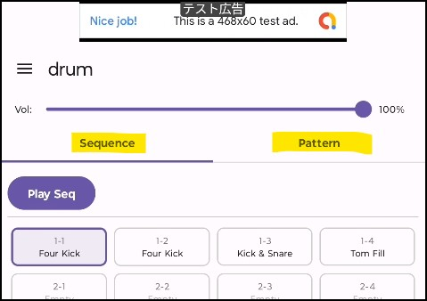
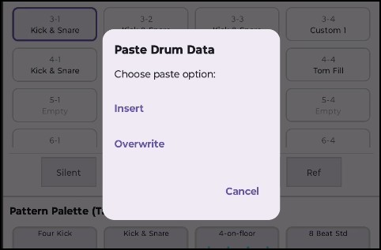
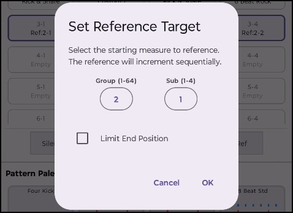
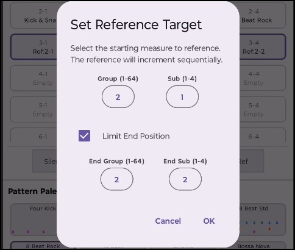

# 概要

InstaPlayComposeの Drum画面 では、ドラムパターンの作成（リズム打ち込み）から、それらを繋ぎ合わせて曲全体のドラムトラックを作成（シーケンス構築）することができます。

画面上部のタブで 2つのモード を切り替えて操作します。
- シーケンスモード
- パターンモード

# シーケンスモード

<iframe width="250" height="444" src="https://www.youtube.com/embed/tMxX5XyUuiY" frameborder="0" allowfullscreen></iframe>

## 基本的な使い方

ドラムシーケンスは、「Sequence」のタブを選択していると表示されます。

曲の展開（1小節〜256小節）にリズムパターンを割り当ててシーケンスを作成します。

1. 小節の選択
  - グリッド上の小節マス（1-1, 1-2 など）をタップします。
2. パターンの割り当て
  - 下部の Pattern Palette から割り当てたいパターンをタップします。
  - 選択中の小節にパターンが配置され、自動的に次の小節へ選択が移動します。
3. シーケンス再生
  - Play Seq ボタンを押すと、選択されている小節から再生されます。
  - 終端(以降Emptyのみ)に達した場合には、最初の1-1の小節から繰り返し再生されます。
  - Stopボタンで停止します。

## 編集機能

グリッド上の小節マスの下にある、機能ボタンの使い方について説明します

### Silent

選択している小節をSilent状態(無音状態)にします。

### Erase

選択している小節をEmpty状態にします。

長押しの場合には選択中の小節を削除し、後ろの小節を前に詰めます。

小節が未選択状態で長押しする事で、全小節をクリアできます。

### Insert

選択している小節の手前に、Empty状態の小節を挿入します。

### Copy

選択している小節の設定をクリップボードにコピーします。

小節を選択状態にしたあと、その小節を長押しすると、挿入か上書きの選択が表示されます。
挿入の場合には以降の小節を後ろにずらしてから、コピーされた内容が設定されます。
上書きの場合にはコピーされた内容をそのまま上書きします。

<iframe width="250" height="444" src="https://www.youtube.com/embed/45yfMChE4C4" frameborder="0" allowfullscreen></iframe>

### Ref

同じフレーズやサビのリズムを何回もコピー＆ペーストせずに、特定の小節を参照することができます。参照先のパターンを変更すると、参照元も自動的に変更されます。

1. 参照を設定したい小節を複数選択します
2. Refを押して、参照設定ダイアログを開きます
3. 参照先の小節を指定します
  - 
4. LimitEndPositionを有効にした場合には、参照する小節の範囲を指定します。
  - 

例えば、小節を4つ選択している状態で、参照先を2-1に指定しているとします。

LimitEndPositionが無効の場合、2-1, 2-2, 2-3, 2-4 が参照先として設定されます。

<iframe width="250" height="444" src="https://www.youtube.com/embed/ODme7Wx9F5c" frameborder="0" allowfullscreen></iframe>

LimitEndPositionを有効にし、LimitEndPositionに2-2を指定した場合、
2-1, 2-2, 2-1, 2-2 が参照先として設定されます。

<iframe width="250" height="444" src="https://www.youtube.com/embed/40WMJR16W9U" frameborder="0" allowfullscreen></iframe>

# パターンモード

ドラムの音色をグリッドに打ち込んでオリジナルのリズムパターンを作成します。

<iframe width="250" height="444" src="https://www.youtube.com/embed/5P1elfjTKAw" frameborder="0" allowfullscreen></iframe>

## 基本的な使い方

「Pattern」タブを選択していると表示されます。

画面上部にはパターンを保持するスロットが24個あり、12個にはプリセットのパターンがあらかじめ設定されており、残りは空です。プリセットのパターンも編集可能です。

パターンを変更したいスロットを選択している状態で、画面下のパターン編集エリアで編集をすることができます。

演奏パターンを設定できる楽器の種類を以下に示します。
- クラッシュシンバル
- オープンハイハット
- クローズドハイハット
- タム
- スネアドラム
- キックドラム

設定の粒度は16ステップと32ステップを切り替えることができます。

ドラムパーツの行とタイミング（ステップ）が交差するマスをタップすると、音の ON / OFF が切り替わります（タップ時に試聴音が鳴ります）。

プリセットの場合「Reset」ボタンが表示されるので、これを押すとそのパターンを初期状態に戻す事ができます。

「Play Pattern」ボタンで、編集中のパターンの演奏を確認できます。演奏しながらパターンの編集が可能です。

# 便利なテクニック・Q＆A

- Q. 複数小節を一度に選択するには？
  - 最初の小節をタップしたあと、範囲の終わりの小節を 長押し すると、その間にある小節を一括選択できます（一括コピーや一括消去に便利です）。

- Q. 曲の長さを途中で伸ばしたい・詰めたい
  - Insert ボタンで途中に空の小節を挿入したり、Erase ボタンの長押しで不要な小節を削除（削除詰める）できます。
