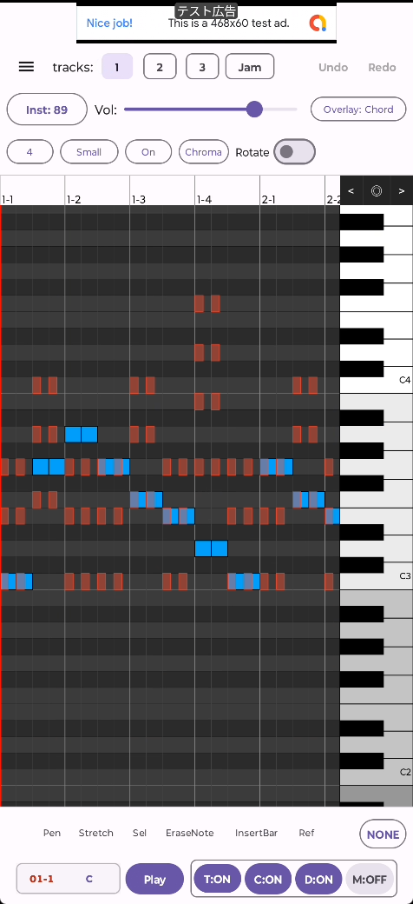
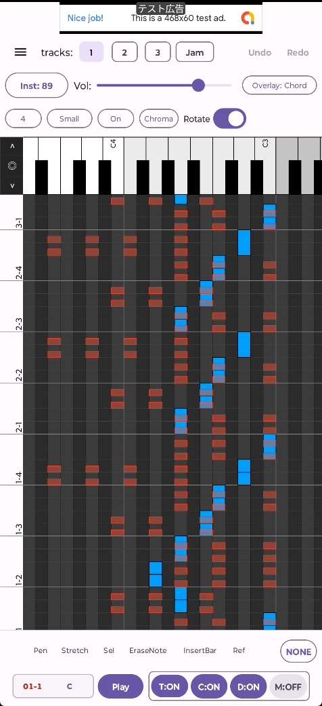
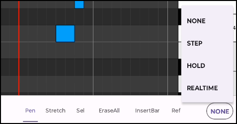
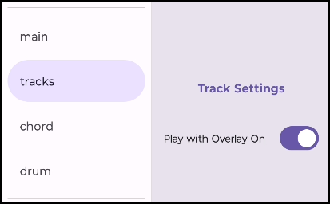

**English** | [日本語](../ja/track)

# Overview

  

    
  

  

    
  

The **Track Screen** (Piano Roll Editor) allows you to enter, edit, and arrange melodic notes visually for each track. Compose melodies, basslines, and counterpoints aligned with chord and drum tracks, fine-tune timing, or edit real-time recordings.

The app supports 4 tracks in total:
- **Tracks 1〜3**:
  - Programmable tracks for melodies, chords, and basslines. Playback synchronizes with ConfigureLoop (loops and jumps).
- **Track Jam (Track 4)**:
  - Holds live keyboard performances recorded on the Main Screen. Plays linearly along absolute song time.

> 💡 **Tip**
> For detailed explanation of how Jam Track and Backing Tracks interact during loops, see [ConfigureLoop & Bar Positions](playflow).

Individual volume and instrument settings can be assigned per track.

- **Full-featured Piano Roll Editing**:
  - 3 grid cell size options (Small, Medium, Large) and optional hiding of black keys.
  - Step, Hold, and Realtime input modes from on-screen keyboard.
  - Note shifting, stretching, and quantizing.
- **Overlay**: Display notes from other tracks or chord accompaniment as background reference.
- **Chroma**: Display note pitch classes across all octaves with translucent outlines to inspect harmonic alignment.
- **Undo / Redo**: Instant multi-level undo and redo for all editing operations.

---

# Screen Layout & Basic Operations

## Piano Roll (Grid Area)

- **Input & Edit Notes (Pen Tool)**
  - Tap or drag on the grid to place notes at specific pitches and lengths.
  - Tap an existing note to delete it (or use EraseNote tool).
  - Drag a note to move its pitch and timing.
  - Drag the end edge of a note to adjust duration (or use Stretch tool).
  - <iframe width="250" height="444" src="https://www.youtube.com/embed/7EhSSyPRq70" frameborder="0" allowfullscreen></iframe>

- **Screen Scrolling**
  - Two-finger drag (or one-finger in empty areas) scrolls the grid view.
  - One-finger horizontal drag on the bar number header scrolls bars left/right.
  - `<` and `>` arrow buttons step through bars; `◎` centers view on the cursor.
  - <iframe width="250" height="444" src="https://www.youtube.com/embed/LoMWsjrtwsk" frameborder="0" allowfullscreen></iframe>

- **Cursor Placement**
  - Tap the bar number header to position the cursor aligned to grid cells.
  - Playback and step recording start from the cursor position.
  - <iframe width="250" height="444" src="https://www.youtube.com/embed/pzljRwludjM" frameborder="0" allowfullscreen></iframe>

- **Selection (Sel Tool)**
  - Drag vertically across bar numbers to select entire bar sections.
  - Box-drag across the grid to select specific note clusters.
  - Selected notes are automatically copied to clipboard.
  - Batch operations on selection: Delete (ripple left), Clear, Shift (cells/octaves/bars), Quantize.
  - <iframe width="250" height="444" src="https://www.youtube.com/embed/K_b1Ht9mtXw" frameborder="0" allowfullscreen></iframe>

## Toolbar (Editing Modes)

Tap tools at the bottom toolbar to switch modes:

| Tool | Category | Action |
| :--- | :--- | :--- |
| **Pen** | Note Input | Tap/drag to insert notes. Tap note to delete. |
| **Move** | Note Move | Drag notes to reposition pitch or timing. |
| **Stretch** | Duration | Drag note ends to adjust length. |
| **EraseNote** | Deletion | Tap notes to delete individually. |
| **DeleteBar** | Ripple Delete | Tap bar to delete 1 bar and shift following bars left. |
| **EraseAll** | Track Clear | Clears all notes on the active track (with confirmation). |
| **InsertBar** | Time Insert | Inserts 1 empty bar at tap position. |
| **InsertCell** | Time Insert | Inserts 1 empty cell at tap position. |
| **Ref** | Reference | Links bar playback to another source bar. |

## Keyboard Input Modes

Select the input mode using the button on the right under the keyboard:

### 1. `NONE` (Preview / Practice)
Pressing keys plays preview sounds without writing notes to the track.

### 2. `STEP` (Step Recording)
1. Select Quantization length (e.g. `16` or `8`).
2. Position cursor on the track.
3. Each key press enters a note of fixed quantize length and automatically advances the cursor.

### 3. `HOLD` (Hold Duration Input)
1. Position cursor on the track.
2. Hold keys longer for long notes (half/whole notes), tap briefly for short notes (16th notes).
3. Cursor moves to the end of the entered note upon key release.

### 4. `REALTIME` (Live Recording)
1. Switch to `REALTIME` and press **Play**.
2. Play keys in real time along with playback; notes are recorded with exact timing and durations.

## Playback Control Panel

Controls global playback and solo/mute states (T, C, D, M) identically to the Main screen. Long-press `T:ON` to toggle individual tracks.

---

# ❓ FAQ

#### Q1. Notes are entered, but no sound plays during playback.
1. Check that `T:ON` is enabled on the bottom panel.
2. Long-press `T:ON` and verify that the target track is checked.
3. Check that track Volume is not set to 0.

#### Q2. Translucent notes appear when Chroma is ON, but cannot be selected or edited.
Translucent outlines represent notes sounding in other octaves. Scroll vertically to the actual octave of the note to edit it.

#### Q3. Why are bar numbers displayed in Red?
Red numbers indicate positions following ConfigureLoop rules (loops and jumps).

#### Q4. Playback stutters or lags with Overlay enabled.
Displaying complex overlays on older devices may cause slight stutter. Turn Overlay to `None` or disable **Play with Overlay On** in the hamburger menu under Track settings.

