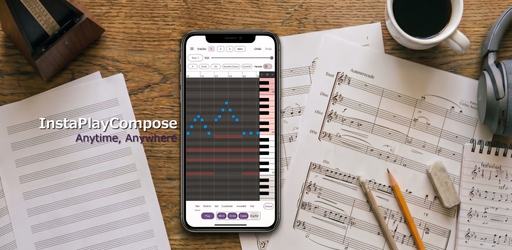
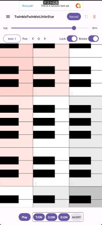
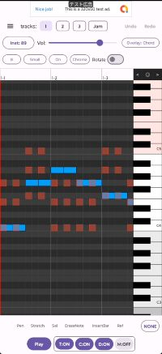
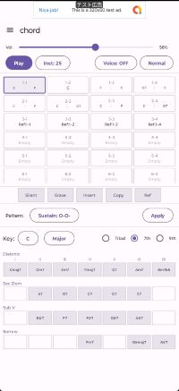
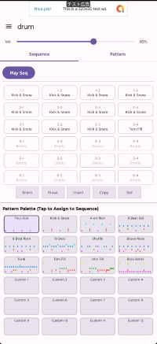
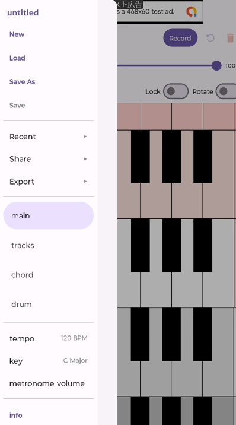

# ご紹介

InstaPlayComposeは、軽量でシンプルな作曲支援スマフォアプリです。
好きな時・好きな場所で、スマフォで作曲ができます。

本アプリで生成した音楽データをシェアしたり、エクスポート（MID,MP3,OGG）が可能です。

シンプルな使い方として、画面上の鍵盤をアドリブ演奏し保存・再生する事ができます。

ドラムのパターンやシーケンス編集、コードのシーケンス編集、
演奏ノートをピアノロールで編集も可能です。
 
本アプリでは、以下の４つの画面で編集や演奏をします。

  

    
  

  

    
  

  

    
  

  

    
  

左から順に…

- [main画面](main)
  - ドラム・コード伴奏を演奏しながら、鍵盤で演奏や録音ができます。
- [track画面](track)
  - ピアノロールでノートを編集できます。
  - 3つのトラックと、Jamトラック（main画面で演奏・録音したノートを保持）を扱えます。
- [chord画面](chord)
  - 小節ごとにコードの種類と伴奏パターンを指定できます。
- [drum画面](drum)
  - 既定または編集したドラムパターンを選択し、小節ごとに割り振りできます。

画面左上の「ハンバーガーメニュー」(menu)から画面の切り替えや各種設定が可能です。

<table style="border: none; border-collapse: collapse;">

  <tr style="border: none;">
    <td style="border: none; vertical-align: top; width: 50%;">
      
    </td>
    <td style="border: none; vertical-align: top; width: 50%;" markdown="1">

| 項目 | 内容 |
| :--- | :--- |
| New | 新規作成 |
| Load | 読み込み |
| Save As| 名前を付けて保存 |
| Save | 保存 |
| --- | --- |
| Recent | 最近使ったデータ |
| Share | GoogleDriveなどへの保存・読み込み |
| Export | MIDI/MP3/OGGへの出力
| --- | --- |
| main | main画面表示と設定 |
| track | track画面表示と設定 |
| chord | chord画面表示 |
| drum | drum画面表示 |
| --- | --- |
| tempo | テンポ設定 |
| key | key設定 |
| metronome volue | メトロノーム音量設定 |
| --- | --- |
| info | アプリ情報 |

</td>
</tr>
</table>

# 制限事項

- 4拍子のみ対応しています。
- 小節数は256個（track-jamについては396個）まで対応しています。

# 免責事項

こちらの[「免責事項」](disclaimer)を参照してください。
