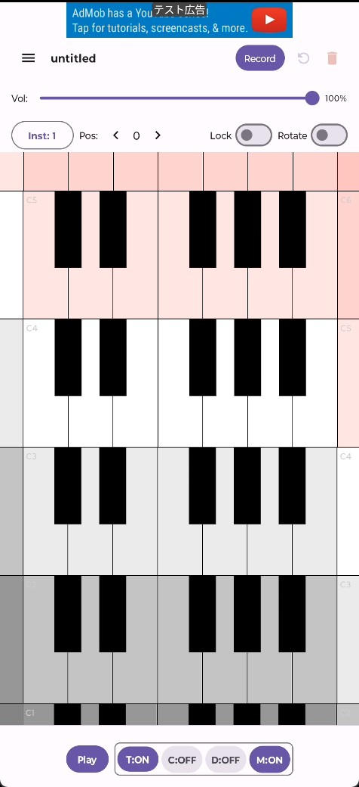
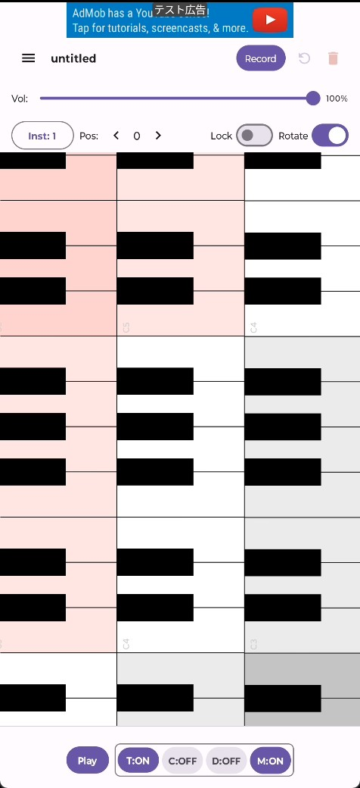
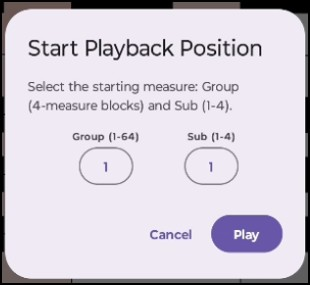
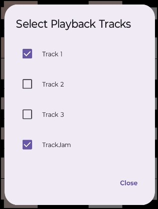

[English](../en/main) | **日本語**

# 概要

メイン画面（Main Screen）は、
- 演奏の中心となる「2Dグリッド鍵盤」
- 伴奏の再生・録音をコントロールする「コントロールパネル」

で構成されています。

特徴を以下に示します。
- 広大な音域を自由に演奏できる「2Dグリッド鍵盤」
  - 8オクターブ分の鍵盤が上下左右に敷き詰められており、スクロールすることで広大な音域へ瞬時にアクセスできます。
  - 音域の切り替えボタンを何度も押す必要なく、直感的なタッチ操作で演奏可能です。
- 多層バッキング（伴奏）とのリアルタイムセッション
  - 作成したトラック（T）・コード伴奏（C）・ドラムパターン（D）・メトロノーム（M）をボタン一つでON/OFFし、バック演奏に合わせたソロ演奏やフレーズ練習ができます。
- ワンタップで即興（ジャム）録音（TrackJam）
  - バッキングを聴きながら鍵盤を弾くだけで、リアルタイムに自分の演奏を録音可能。やり直し（Undo）や消去（Clear）もワンタッチで行えます。

  

    
  

  

    
  

# 再生操作

伴奏レイヤーの再生・停止および各要素の有効/無効を切り替えます。

| ボタン | 通常タップ（機能） | 長押し操作 |
| :--- | :--- | :--- |
| **`Play` / `Stop`** | 全バッキングレイヤーの再生開始／停止 | 再生を開始する位置（小節Group/Sub）選択ダイアログを表示   |
| **`T:ON` / `T:OFF`** | トラック再生（Track 1〜3 + TrackJam）のON/OFF | 各トラック（Track 1〜4）の個別ミュート選択ダイアログを表示  |
| **`C:ON` / `C:OFF`** | コード伴奏再生（Chord）のON/OFF | - |
| **`D:ON` / `D:OFF`** | ドラムシーケンサー再生（Drum）のON/OFF | - |
| **`M:ON` / `M:OFF`** | メトロノーム（Metronome）のON/OFF | - |

左側には、現在再生している小節位置と、対応するChord画面で設定されたコード名が表示されます。

# おすすめの使い方・演奏の流れ

## シンプルに鍵盤楽器として演奏する

1. 上部の Inst ボタンで好きな音色（ピアノ、エレクトリックピアノ、ストリングスなど）を選びます。
2. Lock スイッチをONにして、グリッサンドや軽快なキーボード演奏を楽しみます。

## 伴奏に合わせて即興演奏（ジャム演奏）＆リアルタイム録音する

1. 下部パネルの C:ON（コード伴奏）や D:ON（ドラム）を有効にします。
2. 上部の Record ボタンをタップします。
3. 1小節のカウントインの後、自動で伴奏が流れ始めるので、それに合わせて鍵盤を演奏します。
4. 演奏が終わったら Save をタップ。録音したフレーズは T:ON（トラック再生）でいつでも確認できます。
5. 納得がいかない場合は ↺（Undo）を押せばすぐにやり直せます。
6. 録音したフレーズはTrack画面でJamトラックに格納されており、ピアノロール上で編集可能です。
  - 微妙にずれた演奏タイミングを、クォンタイズで揃えることができます。

## 曲の途中（特定の小節）からピンポイントで練習・録音する

1. Play ボタンや、Record ボタンを長押しして、再生したい小節（例: 4小節単位のGroupやSub）を指定します。
2. 弱点箇所の集中練習や、曲の途中からの差し替え録音がスムーズに行えます。

# 知っておくと便利なテクニック

> [!TIP]  
> **長押しショートカットを活用しよう**
> - **`Record` ボタン長押し**: 途中小節からの録音開始ダイアログを表示（特定のフレーズの撮り直しに便利！）
> - **`Play` ボタン長押し**: 途中小節からの再生開始ダイアログを表示（サビや特定の小節の集中練習に最適！）
> - **`T:ON` ボタン長押し**: バックで鳴らすトラック（Track 1〜3およびTrackJam）の個別の再生／ミュートを切り替え

> [!NOTE]  
> **鍵盤スクロールとグリッサンド（滑走演奏）の使い分け**
> - **スクロールモード (`Lock: OFF`)**: 画面をドラッグして見たい音域・演奏しやすい位置にドラッグで移動しながら演奏できます。
> - **グリッサンドモード (`Lock: ON`)**: 画面のスクロールがロックされ、指を鍵盤上でスライドさせるグリッサンド演奏や高精度なコード打鍵が可能になります。
> **Rotate:ONにする**
> - 鍵盤が縦方向に並ぶので、演奏時に画面に表示される横方向の鍵盤の個数が増え、より広い範囲を自然に演奏できるようになります。

> [!IMPORTANT]  
> **ピンポイントパンチイン（部分録音）の仕様**
> `Record` の長押しで指定小節（例: Group 2 - Sub 1）から録音を開始すると、**その開始位置以降のTrackJamノートのみが上書き**されます。指定位置より前の演奏データは安全に保持されます。

> [!RECOMMENDED]  
> **画面回転（`Rotate`）で演奏スタイルをチェンジ**
> `Rotate` スイッチをONにすると画面が90度回転します。スマホを縦持ちしたまま両手の親指で演奏したり、広範囲の鍵盤を片手で素早く往復したい場合に非常に快適です。
